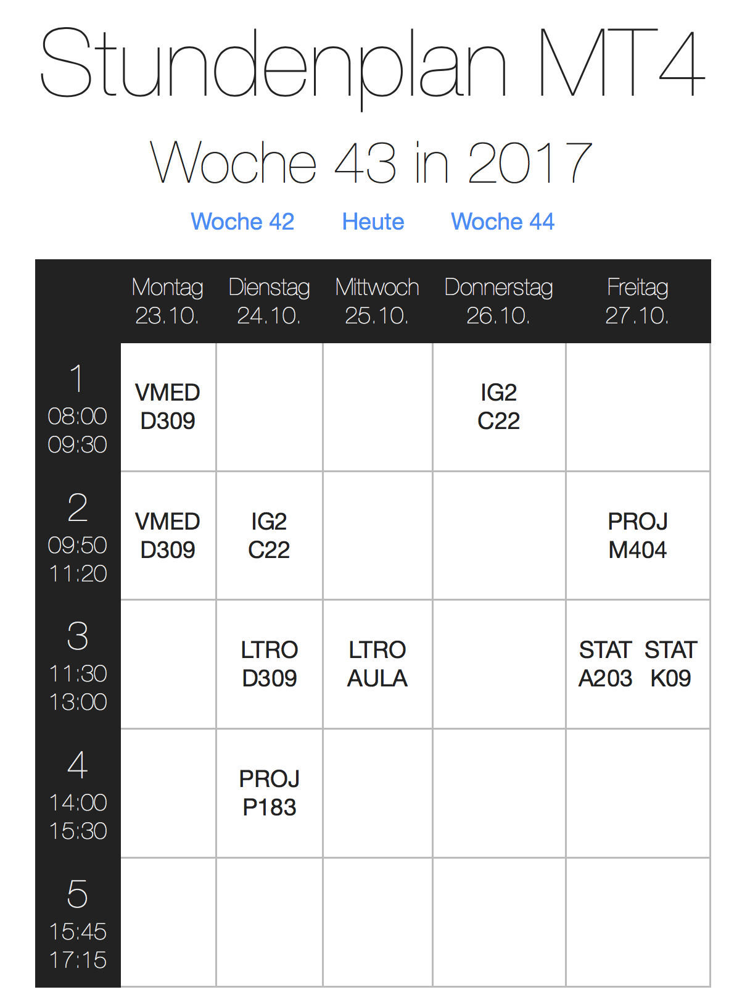

# HS-TT – Timetable of HS Ulm


## How it works
* Load every module you have signed up to
* Load information to every lecture of those modules
* Apply rules defined in config/rules.js
* Generate html page on http request

## Installation
### With Docker
* Requirements: Docker and Docker-Compose
* `wget https://raw.githubusercontent.com/Birkenstab/HS-TT/master/docker-compose.yml`
* Create file config/loginCredentials.js that contains:
    ```
    module.exports = {
     username: "your university username",
     password: "your password"
    };
    ```
* `docker-compose up`
* Go to [localhost:3000](http://localhost:3000)


### Without Docker
* Requirements: Node 8 and NPM
* `npm install`
* Create file config/loginCredentials.js that contains:
    ```
    module.exports = {
       username: "your university username",
       password: "your password"
     };
    ```
* Create a folder named `cache`
* `npm start`
* HS-TT will start to make dozens of requests, this can take up to a few minutes
* Go to [localhost:3000](http://localhost:3000)

## Defining rules
* Rules are stored in `config/rules.js`
* Have a look at `samples/rules.js` to get an idea how the rules work

## Building
`docker build -t birkenstab/hs-tt .`
